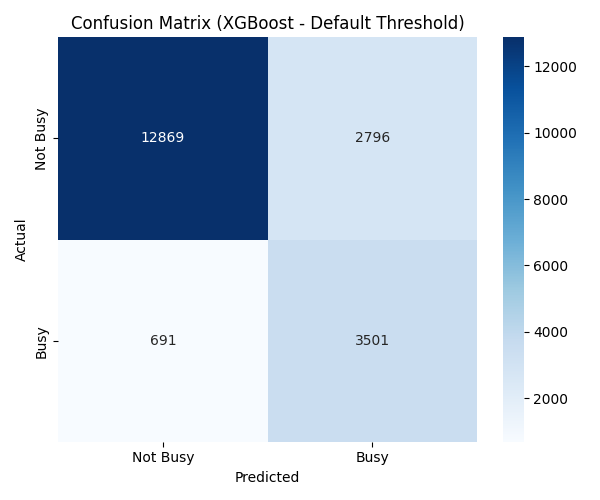

# EV Charging Station Busyness Prediction

## Project Overview

This project aims to predict the busyness of Electric Vehicle (EV) charging stations using real-life historical data. By considering a variety of data processing techniques, feature engineering, and machine learning models, the goal is to accurately classify periods as "Busy" or "Not Busy," optimizing for the F1-score. The pipeline includes data handling, model training, hyperparameter tuning, feature selection, and detailed performance evaluation with visualizations.

## Problem Statement

Accurate prediction of EV charging station busyness is crucial for optimizing resource allocation, managing demand, and improving user experience. This project focuses on building a robust predictive model.

## Key Features & Pipeline Components

The solution is structured as an end-to-end machine learning pipeline, encompassing the following stages:

1.  **Data Loading and Cleaning:**
    * Loads datasets from specified file paths.
    * Handles missing values, duplicates, and ensures data quality.
    * **Dataset Shape:** (66334, 20)

2.  **Feature Engineering:**
    * Creation of time-based features.
    * Calculation of rolling averages and IQR for busyness over different periods.
    * Generation of interaction features.
    * New features created based on logical groupings and time-series behavior.

3.  **Data Preprocessing:**
    * Data resampling and splitting into training and testing sets.
    * Encoding of categorical target variables (`daily_period_busyness_cat` -> `0` for 'Not Busy', `1` for 'Busy').

4.  **Model Training and Evaluation:**
    * Utilizes `ModelTrainer` to handle model training, hyperparameter tuning, and evaluation.
    * Employs `RandomizedSearchCV` for efficient hyperparameter optimization.
    * Evaluates models using a comprehensive set of metrics: Accuracy, Precision, Recall, F1-score, ROC AUC, and Confusion Matrix.
    * Includes a threshold tuning step to find the optimal classification threshold that maximizes F1-score.

5.  **Feature Selection:**
    * After initial training, feature importances are calculated for each model.
    * Features contributing significantly to cumulative importance are selected, and less important features are removed. This aims to reduce model complexity and improve generalization.

6.  **Optimized Model Retraining:**
    * Models are retrained using only the selected features and the best hyperparameters found previously.
    * Performance metrics are re-evaluated for the optimized models.

7.  **Visualization:**
    * `Visualizer` class generates various plots including:
        * Confusion Matrices
        * ROC Curves
        * Precision-Recall Curves
        * F1-score vs. Threshold Plots
        * Feature Importance Bar Plots (showing selected vs. removed features)

## Models Used

The project evaluates three gradient-boosting models known for their performance in tabular data:
* **RandomForest**
* **XGBoost**
* **LightGBM**

## Handling Class imbalance
The classes are quite imbalanced:

* Not Busy:    55799
* Busy:        23629

To tackle this large imbalance, the weight was calculated in input as a parameter within the XGBoost's hyperparameters, while `'class_weight': ['balanced']` was considered for RandomForest and LightBGM.

Initially undersampling of the majority class was considered, however in that case too much data is disregarded.

On the other hand, oversampling of the minority class is not viable, as there would then be overlap, with periods of the day simultaneously being Busy and Not Busy. Oversampling of the minority class would effectively mean disregarding Not Busy periods and 'rewriting' them as Busy.

## Results and Performance Summary

The pipeline runs all models through an initial training and an optimized retraining phase (after feature selection). The primary optimization metric is the F1-score for the 'Busy' class.

The metrics for all models were very similar and hence here only the results for XGBoost are discussed.
### XGBoost Performance

| Metric              | Initial Run (Default Thresh) | Initial Run (Optimal F1 Thresh) | Optimized Run (Optimal F1 Thresh) |
| :------------------ | :--------------------------- |:--------------------------------| :---------------------------------- |
| Accuracy            | 0.82                         | 0.84                            | **0.85** |
| Precision ('Busy')  | 0.56                         | 0.59                            | **0.61** |
| Recall ('Busy')     | 0.84                         | 0.78                            | **0.73** |
| F1-score ('Busy')   | 0.67                         | **0.67**                        | **0.67** |
| ROC AUC             | 0.91                         | 0.91                            | 0.90                                |
| Selected Features   | N/A                          | N/A                             | 10 out of 32                        |
| Optimal Threshold   | 0.50 (Default)               | 0.56                            | 0.59                                |

| Metric                 | Initial Run (Default Thresh) | Initial Run (Optimal F1 Thresh) | Optimized Run (Optimal F1 Thresh) |
|:-----------------------|:-----------------------------|:--------------------------------|:----------------------------------|
| Accuracy               | 0.82                         | 0.84                            | **0.85**                          |
| Precision ('Not Busy') | 0.95                         | 0.94                            | **0.92**                          |
| Recall ('Not Busy')    | 0.82                         | 0.86                            | **0.88**                          |
| F1-score ('Not Busy')  | 0.88                         | **0.89**                        | **0.90**                          |
| ROC AUC                | 0.91                         | 0.91                            | 0.90                              |
| Selected Features      | N/A                          | N/A                             | 10 out of 32                      |
| Optimal Threshold      | 0.50 (Default)               | 0.56                            | 0.59                              |

**XGBoost Key Findings:**
* Achieved a strong F1-score of **0.67** consistently.
* The optimal threshold (0.56 -> 0.59) shifted the balance from higher recall to higher precision, maintaining the same F1-score but reducing False Positives in the optimized run.
* Feature selection reduced the number of features from 32 to 10 without degrading performance (F1-score remained 0.67).

## Visualizations

The project generates several plots saved in the `./plots` directory to aid in understanding model performance and feature contributions:

* **Confusion Matrix:** Provides a clear breakdown of True Positives, True Negatives, False Positives, and False Negatives.
* **ROC Curve & AUC:** Visualizes the trade-off between True Positive Rate and False Positive Rate.
* **Precision-Recall Curve:** Shows the trade-off between Precision and Recall for different thresholds.
* **F1-score vs. Threshold Plot:** Helps in identifying the optimal threshold that maximizes the F1-score.
* **Feature Importance Plots:** Bar charts illustrating the relative importance of features as determined by the models, distinguishing between selected and removed features.

**Confusion matrix plot:**

**Feature importances:**

**The Precision-Recall curve below demonstrates the trade-off between the model's ability to avoid false positives (Precision) and its ability to capture all true positives (Recall) across varying classification thresholds**

.png)

**Confusion matrix plot (tuned threshold and selected features)**:

**The Receiver Operating Characteristic (ROC) curve visualizes the model's diagnostic ability by plotting the True Positive Rate against the False Positive Rate. The Area Under the Curve (AUC) value indicates the overall discriminatory power of the model, with an AUC of 0.90 demonstrating strong performance in distinguishing 'Busy' from 'Not Busy' periods.**

## File Structure

* `Pipeline.py`: Orchestrates the entire data processing and model training workflow.
* `model_training.py`: Contains the `ModelTrainer` class responsible for model training, hyperparameter tuning, and evaluation.
* `vizualisation.py`: Contains the `Visualizer` class for generating various plots.
* `parameters.py`: Stores global parameters and configurations for the pipeline.
* `data_fields.py`: Contains strings of feature names.
* `loading.py`, `cleaning.py`, `features.py`, `rolling_averages.py`, `preprocessing.py`, `data_preprocessing_utils.py`, `interacting_features.py`: Modules containing functions for specific data processing steps.
* `plots/`: Directory where all generated visualization plots are saved.
* `pipeline_run.log`: Log file containing detailed execution information.